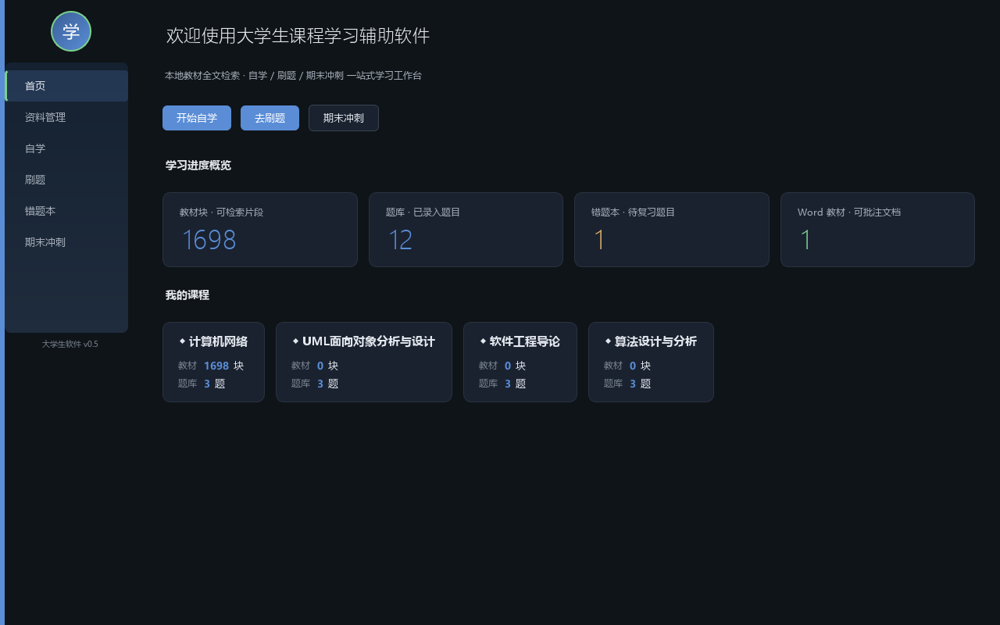
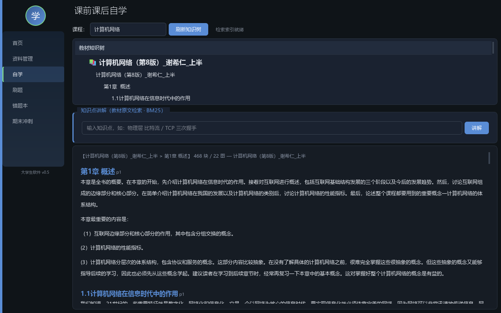
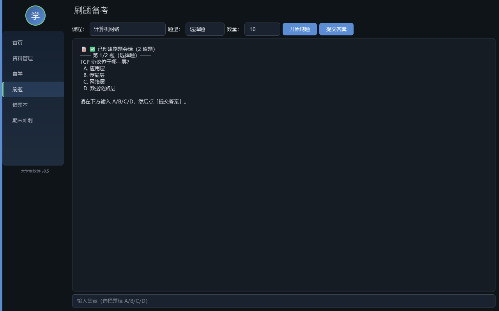
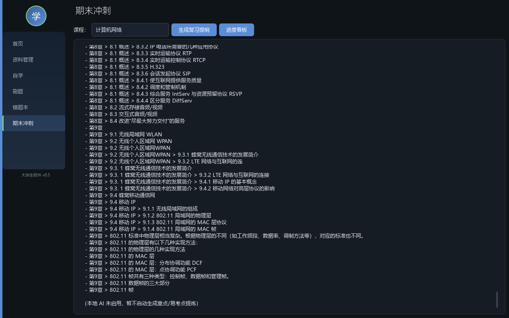
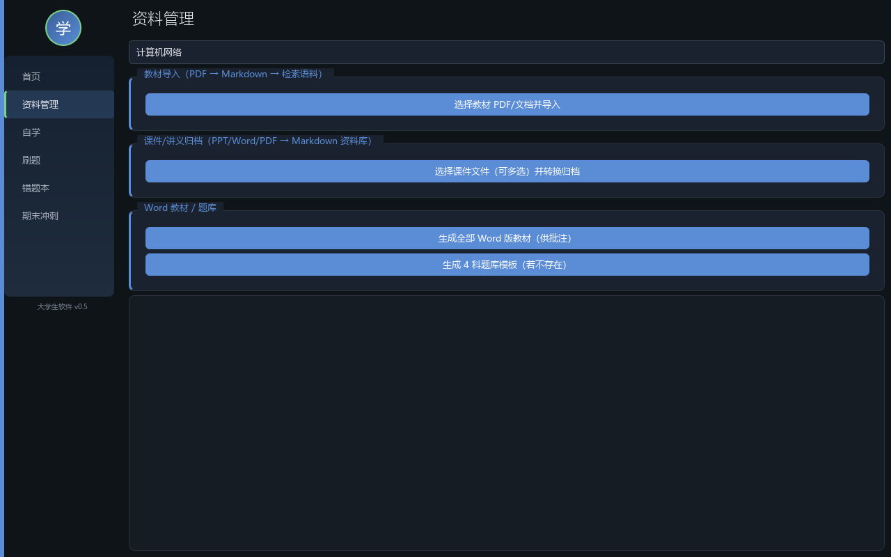
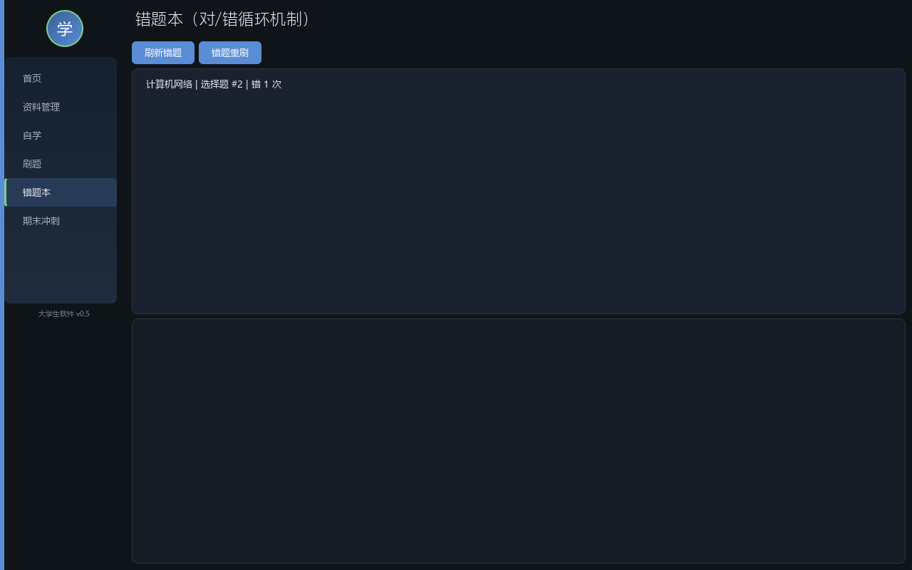

# 大学生课程学习辅助软件

> 本地离线学习工作台：**扫描版教材 PDF → OCR → 版面还原 → 检索语料 → 桌面 App + 离线网页阅读器**。
> 工作目录：`D:/atomcode/大学生软件/` · 版本：**v0.5**（文档流水线闭环）· 更新：2026-09-16

**这是本项目的唯一入口文档。** 看完这一页就能上手，需要细节再按 §5 索引跳转。

> ℹ️ **从 GitHub 克隆下来的？先看这里。**
> 本仓库只含**程序本体**：`src/`（引擎/服务/UI）、`tools/`（流水线脚本）、`build/`（验收与探针）、`tests/`、`docs/`。
> 自带运行时（约 3.4 GB）与教材数据（受第三方版权保护）**不在仓库内**，克隆后需按 **§3.1-A** 准备环境、**§3.3** 跑流水线才能出数据。

---

## 0. 新会话怎么开局（复制即用）

把下面整段粘贴给 AI：

```
接手「大学生课程学习辅助软件」项目，工作目录 D:/atomcode/大学生软件/。
Python 一律用 D:/atomcode/大学生软件/tools/Python/python.exe。

请先读这三份（按顺序）：
1. README.md            ← 项目现状与入口（本文件）
2. docs/工程操作规范.md  ← 怎么做：六条铁律 / 排查规程 / Bug 案例库 / 不可行路线 / Prompt 模板
3. docs/架构设计与长期规划.md ← 是什么：分层架构 / 产品定位 / 路线图 / 技术决定

当前基线：485 页 · 插图落位 296/296 · 表格还原 93/93 · 检索验收 9/9 · test_retrieval 15/15。
先复述你理解的「当前状态 + 下一步」，等我确认后再动手。
```

---

## 1. 这是什么

面向在校生的**个人学习工作台**：把教材、课件、题库统一收进本地知识库，提供自学 / 刷题 / 错题 / 期末冲刺全流程辅助。数据与 AI 能力本地运行，**教材原文作为权威依据**，不做无据生成。

首批 4 门课：计算机网络（谢希仁 第8版）· UML2 面向对象分析与设计 · 软件工程导论 · 算法设计与分析。
**当前已完整落地第 1 门**（485 页扫描件全流程跑通），其余 3 门待按同一流水线接入。

### 三层架构（一句话）

```
PySide6 UI  →  src/services/（编排）  →  src/engine/（核心能力）  →  data/（产物）
```

UI 与引擎解耦，引擎零 UI 依赖。详见 `docs/架构设计与长期规划.md`。

### 界面一览（v0.5 实拍）

> 下列截图由 `build/make_screenshots.py` **离屏渲染真实界面**自动生成，不是手绘 mockup。
> 重新生成：`"$PY" build/make_screenshots.py`（全部）或 `… 首页 自学`（指定页）。

| 首页 · KPI 概览 + 课程卡 | 自学 · 知识树 + 教材原文内嵌插图 |
|---|---|
|  |  |

| 刷题 · 选择题作答 | 期末冲刺 · 复习提纲 |
|---|---|
|  |  |

| 资料管理 · 教材导入流水线 | 错题本 · 对错循环 |
|---|---|
|  |  |

---

## 2. 当前状态（实测基线）

### 2.1 文档处理流水线（v0.5 主线，已闭环）

| 指标 | 数值 |
|---|---|
| 整书 | **485 页**（上半 250 + 下半 235） |
| 插图落位 | **296 / 296 = 100%**（每张图后紧跟同名图题、同页） |
| 表格还原 | **93 张，结构合格 93 / 93 = 100%** |
| 检索验收 | **9 / 9 通过**（含拒答、AND→OR 放宽、跨页落位） |
| `test_retrieval` | **15 / 15 通过**（含 7 条 **UI 路径回归锁**，见 §2.2） |
| 阅读器 | 241 节 / 1459 片段 / 296 图 / 93 表 / 页码 1–474 |
| 单册全量 OCR | 上半 1163s · 下半 1071s（≈4s/页） |
| 单册缓存重放 | 上半 **24s** · 下半 **14s**（≈ 50–76 倍加速） |

> **这是回归基准。** 任何改动后跑一遍 §3.4 验收，数字低于上表即视为回归。

### 2.2 应用层

| 项 | 状态 |
|---|---|
| 知识树 | 上册 5 章 / 下册 16 章 / 课件版 9 章（附录已正确归位） |
| 章节阅读 | `QTextBrowser` 内嵌原文 + 插图 + 表格，**保序**呈现（图在原位，不堆章尾）；插图**点击弹窗放大** |
| 检索路径 | 自学页输入框 → `engine/retrieval` **BM25**，语料 **1698 块**，与离线阅读器**完全同源**（含拒答与"未出现词"提示）。首次提问前由后台线程预热索引（≈6s，查询 0.3ms） |
| 向量库 | **已整体移除**（2026-09-23）—— `chromadb` 依赖、`knowledge_base.py`、`data/vector_store/`（261 块）、`tests/test_knowledge_base.py` 全部删除，全项目只剩 BM25 一条路。原数据备份在 `data/backup/2026-09-23-vector_store/` |
| 测试 | `tests/` **9 个测试文件全绿**（`test_retrieval` 15 · `test_materials_service` 11 · `test_study_service` 9 · `test_practice_service` 8 · `test_dashboard_service` 5 + 冒烟），且**不污染真实数据**（测试教材走独立课程名 + `finally` 清理） |
| exe | `dist/大学生软件.exe` **v0.5 已重打包**（2026-09-23，**105 MB** —— 去掉 chromadb 后比上一版小 44 MB）；离屏实测可启动、`crash.log` 空 |

### 2.3 已知限制（不是 bug，别当 bug 修）

| 现象 | 说明 |
|---|---|
| 附录里出现"第1章…第9章" | 是书末**附录A 部分习题的解答**，本就应该挂在附录下 |
| 语料块数 1702 → 2485 | `list_books()` 同时命中了"课件版.md"（第三本），不是异常 |
| OCR 上下标丢失（`10⁶` → `10°`） | 扫描件识别固有限制，只能缓解不能根治 |
| 检索是**词法** BM25，非语义 | 向量升级方案见 `docs/架构设计与长期规划.md` 附录 A |
| 本地大模型（Ollama 等）**已否决** | 2026-09-16 决定不引入本地 LLM，方案材料已清出文档；「答疑」仍为预留位、底座待定。**不要再提** |

---

## 3. 快速开始

### 3.1 环境

**A. 全新克隆（从 GitHub 拿到代码后）**

```bash
git clone https://github.com/cmgyl1/course-study-assistant.git
cd course-study-assistant

python -m venv .venv
source .venv/Scripts/activate        # Windows Git Bash；PowerShell 用 .venv/Scripts/Activate.ps1
pip install -r requirements.txt
```

需要额外准备两样（仅题库/课件格式转换用到，可后补）：

```bash
# pandoc   —— docx/md 互转
# LibreOffice —— pptx/ppt 转换
# 安装后把路径写进 src/engine/config.py
```

再自备教材放入 `data/textbooks/`（见 `data/README.md`），然后按 §3.3 跑流水线。

**B. 本机开发环境（自带运行时，Git Bash 需显式 PATH）**

```bash
export PATH="/c/Users/CHY/.workbuddy/binaries/PortableGit/versions/1.2.0/usr/bin:/c/Windows/System32:$PATH"
cd "D:/atomcode/大学生软件"
PY="D:/atomcode/大学生软件/tools/Python/python.exe"
```

> 项目自带 `tools/Python`（3.12.10）与全部依赖，**B 路无需 pip install**。

### 3.2 跑软件

```bash
"$PY" src/main.py
```

### 3.3 文档流水线（六层，单向依赖）

```bash
# ① 抽取：PDF → 分页 md + 裁切插图（首次全量 ~20 分钟/册）
"$PY" tools/ocr_textbook.py --pdf "计算机网络（第8版）_谢希仁_上半"
# ① 重放：改过 layout.py 后走缓存重放（~24 秒）
"$PY" tools/ocr_textbook.py --pdf "计算机网络（第8版）_谢希仁_上半" --force

# ② 清洗合并：分页 → 整册（剔目录页 / 修页码 / 附录归一）
"$PY" tools/merge_ocr_pages.py --pdf "计算机网络（第8版）_谢希仁_上半"

# ③ 语料 → ④ 阅读 → ⑤ 交付阅读器
"$PY" tools/build_corpus.py
"$PY" tools/build_reader.py          # → data/reader.html

# ⑥ 验收
"$PY" build/acceptance.py --log build/accept_full.log
```

> 完整命令（含全部测试与探针）见 `docs/工程操作规范.md` §8。

### 3.4 验收口径（低于此即回归）

```
插图落位 296/296 · 表格结构 93/93 · 检索 9/9 · test_retrieval 15/15
```

```bash
"$PY" build/acceptance.py --log build/accept_full.log   # 检索 + 插图 + 表格
"$PY" build/verify_inline.py                            # 图片文件实存（防裂图）
"$PY" build/verify_study_page.py                        # 自学页闭环（离屏起真实窗口）
"$PY" tests/test_retrieval.py                           # 检索与阅读层
"$PY" build/_uicheck.py && build/_qtcheck.py 对比        # UI 链路 + 图片真实加载
```

### 3.5 打包 exe

```bash
"$PY" -m PyInstaller --noconfirm --onefile --windowed --name 大学生软件 \
  --paths src --collect-all jieba \
  --distpath dist --workpath build/PyInstaller_work --specpath build src/main.py
```

> 已去掉 `--collect-all chromadb`（2026-09-23 chroma 链路整体移除后不再需要），
> 这是 exe 体积的主要来源之一。

### 3.6 推送代码（网络受限时的备用通道）

`git push` 依赖 `github.com` 可达。若处于企业网络 / 代理白名单环境，
典型报错是 `schannel: server closed abruptly` 或 `CONNECT tunnel failed, response 502`。
此时仍可用 API 通道推送：

```bash
"$PY" tools/push_via_api.py --dry-run     # 先体检：核对 blob / tree / commit
"$PY" tools/push_via_api.py               # 真正推送
```

它不走 git 传输协议，而是用 Git Data API 逐个建出 blob / tree / commit，
**生成的 commit sha 与本地相同**，推完不分叉、不需要 force。
凭据取自 git 凭据管理器，脚本不保存任何密钥。文件头注释有完整说明与边界。

> ⚠️ **两个环境坑（都已内置处理，但值得知道）**
> 1. `git credential fill` 若**零输出挂住**，是 Git for Windows 的 `helper-selector`
>    在等 GUI 选后端。脚本已改为直连 `wincred → manager → 默认链`（各带超时）。
> 2. 推完后 `origin/main` **不会自动前进**（本环境 `git update-ref` 被拦截）。
>    用 `git status` 看着不干净时，手动对齐：
>    `echo <远端sha> > .git/refs/remotes/origin/main`

---

## 4. 最常踩的三个坑（先看这里，能省几小时）

| # | 坑 | 正确做法 |
|---|---|---|
| 1 | **改完代码就跑长任务** → 整批产物作废 | Python 进程启动即定型模块。**先把代码改完落盘，再启动 OCR**（曾经 485 页整批作废，只因 `layout.py` 晚改了 9 分钟） |
| 2 | 在**全量重跑**里调判据（每次 20 分钟） | 改判据前先落盘**原始 OCR 框**（已在 `data/ocr_cache/`）。改完走 `--force` 缓存重放，**24 秒** |
| 3 | 一处判据改了，**另一处同款逻辑没改** | 本项目"标题栈弹栈"缺陷在 **3 个文件**里重复出现。修完必须全项目搜一遍同款 |

其余铁律与 17 条 Bug 案例（按症状检索）见 `docs/工程操作规范.md` §4 / §6。

---

## 5. 文档索引

**只有 3 份活文档 + 1 个归档目录。** 各管一件事，不重复：

| 文档 | 管什么 | 什么时候看 |
|---|---|---|
| **`README.md`**（本文） | **现在到哪了** —— 状态、基线、命令、下一步 | 每次开工第一眼 |
| **`docs/工程操作规范.md`** | **怎么做** —— 六条铁律 / 难问题排查规程 / Bug 案例库 / 不可行路线黑名单 / Prompt 模板库 | 遇到难问题、要改判据、要投喂 AI 时 |
| **`docs/架构设计与长期规划.md`** | **是什么、往哪去** —— 产品定位 / 分层架构与接缝 / 数据来源 / 路线图 / 技术决定 | 要动架构、要加功能、要做技术选型时 |
| `docs/archive/` | **历史归档** —— 已被上述 3 份吸收的旧文档（方案草案 / 工具清单 / 导入指南 / bug-report-v0.4） | 极少。查历史决策时 |

### 写文档的归位规则（**防止再次碎片化**）

新增知识时，按"这份知识回答什么问题"决定放哪：

| 问题 | 归位 |
|---|---|
| 现在什么状态？下一步做什么？ | `README.md` §2 / §6 |
| 怎么做 / 别做什么 / 踩过什么坑？ | `docs/工程操作规范.md` |
| 为什么这样设计？未来怎么走？ | `docs/架构设计与长期规划.md` |
| 日常流水账（改动记录、验证数字） | `.workbuddy/memory/YYYY-MM-DD.md` |

> ⚠️ **不要再往 `docs/` 根目录新增主题文档。** 先判断能否并入上述 3 份的现有章节；确实无法归入时才新建，并同步更新本表。

---

## 6. 目录结构

```
大学生软件/
├── README.md                  ← 唯一入口（本文件）
├── LICENSE                    ← MIT（仅覆盖代码；教材数据不在仓库内）
├── docs/                      ← 3 份活文档 + archive/ 归档
│   ├── 工程操作规范.md
│   ├── 架构设计与长期规划.md
│   ├── images/                ← 界面截图（README §1 引用；由 build/make_screenshots.py 生成）
│   └── archive/
├── src/
│   ├── engine/                ← 核心能力（无 UI 依赖）
│   │   ├── layout.py          ← 🔴 版面还原核心（行→段→标题→图区→表格）
│   │   ├── retrieval.py       ← 🟡 切块 / 标题索引 / BM25 / 放宽 / 拒答
│   │   ├── textbook_reader.py ← 🟡 按章节取保序块序列
│   │   ├── study.py / practice.py / finals.py / question_bank.py / converter.py / config.py
│   ├── services/              ← 编排层（UI 只调这里）
│   ├── ui/                    ← 设计系统 / 动效
│   └── main.py                ← PySide6 主程序
├── tools/                     ← 生产脚本 + 自带运行时（Python / pandoc / LibreOffice）
│   ├── ocr_textbook.py  merge_ocr_pages.py  build_corpus.py  build_reader.py
│   ├── import_textbooks.py  clean_textbook.py  pptx_to_markdown.py
│   ├── push_via_api.py        ← 网络受限时的 GitHub 推送通道（见 §3.6）
│   └── archive_2026-09-23/    ← chroma 专用脚本（已归档：rebuild / quality 检查）
├── build/                     ← 探针与验收脚本（一次性问题用一次，但先留着）
│   ├── acceptance.py          ← 主验收
│   ├── make_screenshots.py    ← 离屏生成 README 界面截图（→ docs/images/）
│   ├── verify_study_page.py   ← 自学页离屏闭环（10 项断言 + 截图）
│   ├── probe_boxes.py         ← 改版面判据的第一手证据
│   ├── archive_2026-09-11/    ← 早期一次性实验（已归档，勿删）
│   └── archive_2026-09-23/    ← 两条检索路的对比探针（chroma 拆除后不可运行，留作取证）
├── tests/                     ← 9 个冒烟测试，默认隔离、不写真实数据
├── data/                      ← 全部产物
│   ├── textbooks/               原始 PDF（唯一权威源，勿删）
│   ├── ocr_cache/<册>/          原始 OCR 框缓存（改判据秒级重放的关键，勿删）
│   ├── textbooks_md/<册>/       分页 md
│   ├── textbooks_md/<册>.md     合并后的整册 md
│   ├── figures/<册>/            裁切插图
│   ├── reader.html              离线阅读器（单文件，与桌面端同引擎）
│   ├── corpus_cache/            检索语料切块缓存（可选，由 tools/build_corpus.py 生成）
│   └── backup/<日期>/           回滚点（保留 ≥30 天，不是垃圾）
├── dist/                      ← 打包产物
└── reserved/                  ← 预留模块位（答疑 / 课程同步 / 移动端）
```

---

## 7. 下一步（按优先级）

1. **人工点检新版 exe** —— `dist/大学生软件.exe` 已于 2026-09-23 重打包（**105 MB**，含检索路径修复
   与 chroma 拆除）。离屏实测可启动，下一步是**肉眼验收**：知识树章节、原文内嵌图是否在原位、
   表格是否正确渲染、**输入框提问是否与离线阅读器给出同样结果**。
2. **接入其余 3 门课** —— 走同一条流水线；扫描件质量不同可能需微调 `layout.py` 判据（改判据流程见规范 §7-P7）。
3. **修「短段落被静默丢弃」**（2026-09-23 发现，**尚未修**）—— `retrieval.build_chunks` 的
   `min_chars=60` 分支在"前一块恰好是标题块"时直接 `continue`，于是**小节首段若短于 60 字会整段消失**
   （搜不到、阅读页也没有）。真实教材影响有限（首段通常较长），但它属于"静默丢数据"，
   与规范 §5 第 8 条相悖。改的是语料构建判据，必须重跑 `acceptance.py` 与 `test_retrieval.py` 对照。
4. **v0.6 语义检索升级（可选）** —— 引入 `bge-small-zh-v1.5`（~95MB）+ `onnxruntime`，与现有 BM25 做 RRF 混合检索。属增益项，不阻塞交付。详见架构文档附录 A。

> **已否决项不进路线图**：本地大模型方案（Ollama）已于 2026-09-16 否决，论证见架构文档附录 B —— **不要再提**。

---

_本文档是项目唯一入口。状态变化时更新 §2 与 §7；新增文档时先读 §5 的归位规则。_

**许可证**：程序本体采用 [MIT License](LICENSE)。仓库**不含**任何教材 PDF 与派生数据
（OCR 文本 / 插图 / 检索语料），那部分版权归原作者与出版方，请自备合法持有的教材后自行生成。
